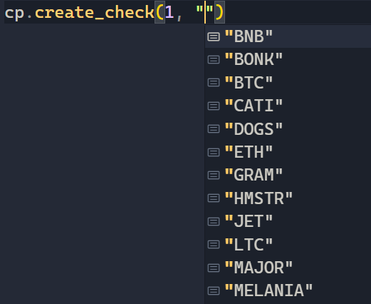
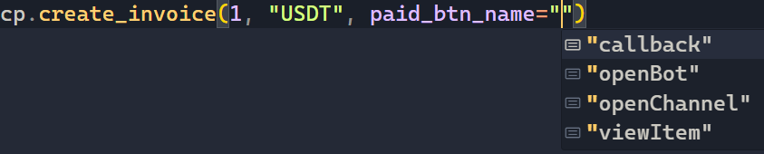

=======================
Type hints and warnings
=======================

Literal type hints
------------------

**aiosend** provides rich typing that allows you not
to remember the values of the enumerated parameters.

Wrong net warning
-----------------

**aiosend** will warn you if you are using the wrong net.

.. code-block:: python
    
    from aiosend import CryptoPay, TESTNET
    cp = CryptoPay("MAINNET token", TESTNET)

.. code-block:: bash

    aiosend.exceptions.WrongNetworkError: Authorization failed.
    Token is served by the MAINNET, you are using TESTNET